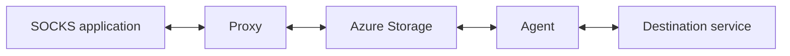

# ProxyBlob

ProxyBlob is a reverse SOCKS5 proxy that uses [aznet](https://github.com/atsika/aznet) to carry traffic through Azure Storage services. Run the proxy locally and an agent on the machine whose network you want to access.

## Getting started

Build with `make`, configure your storage account, then connect an agent and start its local SOCKS endpoint. The [setup guide](docs/getting-started.md) walks through each step.

- [Usage](docs/usage.md): commands, applications, logging and upgrades.
- [WASM agent with Bun](docs/usage.md#wasm-agent-with-bun).
- [Troubleshooting](docs/troubleshooting.md).

ProxyBlob supports TCP and UDP, plus SOCKS5 BIND with native agents. The SOCKS endpoint defaults to `127.0.0.1:1080` and has no authentication; keep it on loopback unless you control access to it.

## Releases

See the [changelog](CHANGELOG.md) for release history.

## License

[GNU GPLv3 License](LICENSE)

---

Made with ❤️ by [@_atsika](https://x.com/_atsika)
