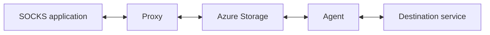

# ProxyBlob

ProxyBlob connects a local SOCKS5 proxy to an agent through Azure Blob, Queue or Table Storage. The agent reaches destinations from its network; the proxy manages listeners, agents and local SOCKS endpoints.

## Start here

Follow [Your first SOCKS connection](docs/getting-started.md) for a complete walkthrough: build, configure local Azurite or Azure, start a listener and native agent, then verify a request with curl. It includes expected output and cleanup commands.

| I want to… | Guide |
|---|---|
| Build and run my first proxy/agent pair | [Getting started](docs/getting-started.md) |
| Switch agents, use another port, or stop a session | [Everyday usage](docs/usage.md) |
| Diagnose a build, connection or speed problem | [Troubleshooting](docs/troubleshooting.md) |
| Use a WASM agent or develop its host | [JS socket host contract and Bun harness](docs/js-socket-host.md) |
| Upgrade an existing deployment | [Rollout and validation](docs/release-validation.md) |

## Supported traffic

| Capability | Native agent | WASM agent |
|---|---|---|
| TCP CONNECT, IPv4/IPv6/domain | Supported | Socket host v2 required |
| UDP ASSOCIATE through the tunnel | Supported | Socket host v2; domains also require `UDPResolve` |
| BIND with both SOCKS replies | Supported | Explicit command-not-supported reply |
| Authentication | NoAuth | NoAuth |
| SOCKS UDP fragmentation | Nonzero FRAG is dropped | Same |

Keep the unauthenticated SOCKS listener on loopback unless access is controlled by your deployment. UDP clients use the relay address returned by the proxy. BIND requires inbound reachability to the agent's advertised interface; it does not create NAT mappings or open firewall ports.

The current tunnel protocol is version 3. Deploy compatible proxy/agent builds together. The WASM binary also needs a compatible host; the repository's Bun 1.4.2 host is a test harness, not a production agent runner.

## Reference

- [Configuration and authorization lifetimes](docs/usage.md#authorization-lifetimes)
- [TCP flow control and memory settings](docs/flow-control.md)
- [UDP behavior and DNS tests](docs/udp-tunnel.md)
- [Native BIND](docs/socks-bind.md) and [real active FTP tests](docs/active-ftp-bind.md)
- [Numeric agent errors](docs/agent-errors.md)
- [Measured performance](docs/performance.md)
- [Exact validation revisions and remaining rollout checks](docs/release-validation.md)
- [aznet transport library](https://github.com/atsika/aznet)

## Releases

See the [changelog](CHANGELOG.md) for release history.

## License

[GNU GPLv3 License](LICENSE)

---

Made with ❤️ by [@_atsika](https://x.com/_atsika)
