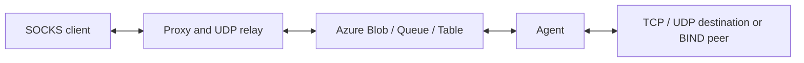

# ProxyBlob v2

<p align="center">
  
</p>
<p align="center"><i>SOCKS proxy over Azure Storage services</i></p>

## Overview

ProxyBlob connects a local SOCKS5 proxy to an agent through Azure Blob, Queue or
Table Storage, using [aznet](https://github.com/atsika/aznet). The agent opens
connections to destination services from its network. Multiple logical streams
share one tunnel, with finite memory reservations and backpressure.

The interactive proxy manages listeners and agents. Native agents support
CONNECT, UDP ASSOCIATE and BIND. A WASM agent is also available for a JavaScript
host implementing the required socket contract.

## Capabilities

| Capability | Native agent | WASM agent |
|---|---|---|
| TCP CONNECT, IPv4/IPv6/domain | Supported | Supported with socket host v2 |
| UDP ASSOCIATE through the cloud tunnel | Supported | Supported with socket host v2; domains require `UDPResolve` |
| BIND, both SOCKS replies | Supported | Explicit command-not-supported reply |
| Authentication | NoAuth | NoAuth |
| SOCKS UDP fragmentation | Unsupported; nonzero FRAG is dropped | Same |

UDP clients send to the relay address returned by the **proxy**, not directly to
the agent. The agent resolves target domains and exchanges destination datagrams.
UDP overload drops complete packets within finite bounds; admitted TCP streams
pause when receive credit is exhausted. Ordered delivery and half-close are
preserved. See [UDP tunneling](docs/udp-tunnel.md), [native BIND](docs/socks-bind.md)
and [flow control](docs/flow-control.md).

BIND advertises an agent interface address selected from the route to the expected
peer. It does not discover public NAT mappings or open firewall ports. The client
must wait for the second reply before sending data. UDP clients likewise need
reachability to the proxy's returned interface and ephemeral port.

## Prerequisites and storage

- Go 1.25 or newer; the validation toolchains are recorded in
  [release validation](docs/release-validation.md).
- An Azure account with the selected storage service, or Azurite for local tests.
- For WASM, a compatible JavaScript socket host; compilation alone is insufficient.

A **Standard general-purpose v2 (`StorageV2`)** account supports Blob, Queue and
Table. Premium Block Blob accounts support Blob operations, including append
blobs, but do not provide Queue or Table. Premium is not required. Choose account
location and service from measurements in your deployment; there is no universal
cost or speed ranking. See Microsoft's [storage account types](https://learn.microsoft.com/en-us/azure/storage/common/storage-account-overview).

For example, after choosing a globally unique account name:

```sh
az login
az group create --name proxyblob-resource-group --location centralus
az storage account create --name YOUR_UNIQUE_ACCOUNT --resource-group proxyblob-resource-group --location centralus --sku Standard_LRS --kind StorageV2
az storage account keys list --account-name YOUR_UNIQUE_ACCOUNT --output table
```

For local Blob, Queue and Table testing, expose all three Azurite services:

```sh
docker run --rm -p 127.0.0.1:10000:10000 -p 127.0.0.1:10001:10001 -p 127.0.0.1:10002:10002 mcr.microsoft.com/azure-storage/azurite:3.34.0
```

The [example configuration](example_config.json) includes the public Azurite
`devstoreaccount1` credentials. Azurite validates supported emulator behavior;
it does not establish Azure service latency or every service-specific failure.

## Build

```sh
git clone https://github.com/quarkslab/proxyblob
cd proxyblob
GOWORK=off GOFLAGS=-mod=readonly make
```

This builds `proxy`, `agent` and `agent.wasm` from package targets using the
committed published aznet dependency. There is no local replacement required.
Individual targets and an optional embedded connection string are supported:

```sh
make proxy
make agent
make wasm
make agent TOKEN='<generated-connection-string>'
make wasm TOKEN='<generated-connection-string>'
```

The WASM runner must load `wasm_exec.js` from the Go toolchain used to build the
binary. It must advertise `globalThis.ProxyBlobSocketHostVersion = 2`, implement
`TCPDial` and `UDPListen`, and implement `UDPResolve` for domain UDP destinations.
These factories return immediate disposable handles; callbacks, bounded queues,
read grants, write backpressure and half-close follow the
[JS socket host contract](docs/js-socket-host.md). The old two-function example
without those semantics is insufficient.

The repository provides a **Bun 1.4.2 test host**, not a production runner.
Node runs supplementary deterministic adapter tests. Production browser,
WebSocket-bridge and other runtime hosts require their own validation.

## Configuration and authorization

Create `config.json` using [example_config.json](example_config.json). For Azure:

```json
{
  "listeners": [
    {
      "name": "blob-listener",
      "driver": "azblob",
      "session_duration": "24h",
      "address": "https://YOUR_ACCOUNT.blob.core.windows.net",
      "storage_account": "YOUR_ACCOUNT",
      "storage_account_key": "YOUR_ACCOUNT_KEY"
    }
  ]
}
```

Use `azqueue` with the Queue endpoint or `aztable` with the Table endpoint for
the other drivers. Multiple listeners are supported. Protect this configuration:
the proxy uses account credentials to issue narrower connection credentials.

`new --duration 168h` controls **bootstrap connection-string validity**; seven
days is the default. `session_duration` independently controls credentials for
new sessions; its default is 24 hours and it accepts Go durations of at least one
second. Expiring bootstrap authorization does not itself terminate an established
session. Automatic credential renewal is not implemented.

`agent ls` displays the actual issued session expiry in UTC and authorization
remaining, or `unknown` when the transport provides no metadata. This countdown
is informational: it is neither a liveness guarantee nor a rounded disconnect
timer. Changing listener configuration does not renew existing sessions.

## Usage

Start the proxy:

```sh
./proxy -c config.json
```

Start a configured listener and generate a bootstrap connection string:

```text
proxyblob » listener start blob-listener
proxyblob » new --duration 168h
```

Copy the generated string to the agent:

```sh
./agent -c '<generated-connection-string>'
```

Alternatively, run an agent built with the embedded string. Back in the proxy:

```text
proxyblob » agent ls
proxyblob » agent select <agent-id>
proxyblob » agent start
```

The SOCKS listener defaults to localhost port 1080. For example, an application
can use SOCKS5 with agent-side target resolution:

```sh
curl --socks5-hostname 127.0.0.1:1080 https://example.com/
```

Use `help`, `help agent` and `help listener` for command options. `agent rm`
removes the selected agent and clears its prompt selection. Teardown is bounded;
a reported delivery or cleanup error still requires attention. Do not interpret
forced abort as proof that all pending data reached its destination.

## Architecture and limits



The client offers authentication methods and the agent selects NoAuth or rejects
the negotiation. Commands and responses travel through the shared tunnel. Each
TCP direction advertises receive credit backed by reserved memory; the consumer
returns credit after releasing bytes. Fair, bounded batches and independent
control admission allow healthy streams and shutdown messages to progress.

Default limits per endpoint include a 512 KiB stream window, 64 MiB receive
reservation budget, a separate 64 MiB outgoing payload budget, 128 streams,
32 KiB DATA frames, 512 KiB encoded batches, 512 control slots and a five-second
graceful drain. UDP adds bounded 256 KiB / 64-packet receive queues and 64 resolved
destinations per association. These budgets do **not** cap whole-process memory.

Configure limits using the environment variables in [flow control](docs/flow-control.md)
and [UDP tunneling](docs/udp-tunnel.md). The [measured baseline](docs/performance.md)
records concurrency, peak heap, latency, allocations, SDK requests and the rationale
for these defaults. Storage latency and polling remain substantial even after
removing Blob's shared read/write lock; no universal throughput guarantee is made.

## Upgrade and validation

Drain existing tunnels and deploy matching proxy and agent binaries together.
The current wire protocol is **version 3**; unsupported and legacy versions are
explicitly rejected during logical-stream setup. This is not a rolling mixed-version
upgrade. For WASM, deploy and validate a compatible socket host v2 as well.
The committed aznet revision is
`v0.0.0-20261006132211-7abcd80a7a28`.

[Release validation](docs/release-validation.md) records exact revisions and
separates builds from runtime evidence: race tests, vet, native and WASM builds,
Bun socket execution, isolated Linux topology, Azurite, and native live Azure
Blob/Queue/Table tests. Production WASM-over-Azure, browser/WebSocket hosts,
public BIND/NAT reachability and deployment-specific soak/performance remain
rollout checks.

## Troubleshooting

If an agent exits immediately, check its exit code and the proxy logs:

| Exit code | Meaning |
|---|---|
| 0 | Normal completion |
| 1 | Context canceled |
| 2 | Missing connection string |
| 3 | Connection-string parsing or connection setup failed |
| 4 | Identity exchange failed |

Check the selected service endpoint, Azure connectivity, credential validity and
matching proxy/agent versions. For WASM, verify host version and callback/disposal
semantics. For slow traffic, compare representative workloads with the recorded
baseline before increasing windows; larger reservations increase memory.

Project-owned agent diagnostics and proxy-side numeric error decoding remain a
follow-up audit. The proxy-owned `ErrToString` map is retained; this release does
not claim that the agent binary contains no explanatory strings.

## CHANGELOG

**Unreleased stabilization:**

- Reserved receive credit, bounded fair scheduling, and ordered half-close.
- Native BIND and cloud-tunneled UDP with explicit overload limits.
- Session authorization expiry display and bounded lifecycle cleanup.
- Socket host v2 and actual Bun 1.4.2 WASM runtime validation.
- Published aznet directional Blob I/O fix and measured performance baselines.
- Coordinated wire-version-3 rollout required; see upgrade notes above.

**ProxyBlob v2.2 - 03/08/2026:**

- Dropped the vendored `azure-sdk-for-go` submodule; the WASM fix it carried is now upstream ([Azure/azure-sdk-for-go#26748](https://github.com/Azure/azure-sdk-for-go/pull/26748))
- Azure SDK dependencies bumped and resolved from upstream, so a plain `git clone` is enough to build

**ProxyBlob v2.1 (WASM agent) - 19/03/2026:**

- WebAssembly agent build target (`agent.wasm`) for deployment in JavaScript runtimes (Bun, Node.js, etc.)
- Build tag separation for JS/native network and UDP code
- Refactored UDP relay into a shared, platform-agnostic layer

**ProxyBlob v2 (aznet boosted) - 16/02/2026:**

- Complete architecture rewrite using aznet networking layer
- Multiple Azure Storage backends (Blob, Queue, Table Storage)
- Last seen timestamps for connected agents
- Enhanced connection management and lifecycle
- Better error handling and recovery mechanisms
- Improved polling efficiency with adaptive intervals
- Automatic connection cleanup and resource management
- Significantly higher throughput and lower latency
- Cost optimization through backend selection
- Multi-listener configuration support

**ProxyBlob public release - 29/04/2025:**

- SOCKS5 protocol (CONNECT and UDP ASSOCIATE)
- Reverse client-server architecture
- Azure Blob Storage communication
- Interactive CLI with auto-completion
- Multi-agent management
- Local or remote proxy server
- Container-based communication
- Connection string authentication
- Error handling
- Azurite support for local development

## License

[GNU GPLv3 License](LICENSE)

---

Made with ❤️ by [@_atsika](https://x.com/_atsika)
